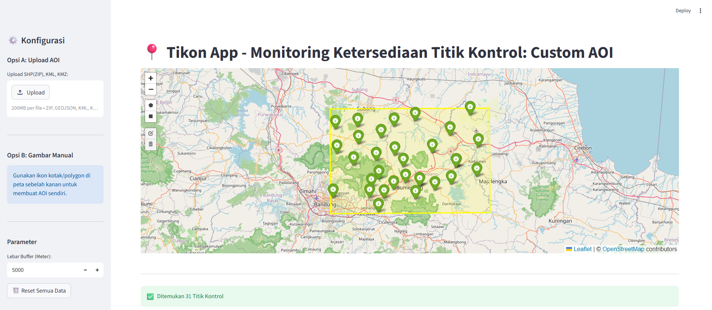
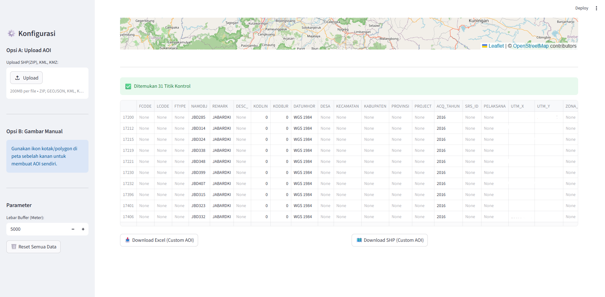

# 📍 Tikon App: Monitoring Titik Kontrol


Aplikasi web berbasis Python (Streamlit) yang dirancang untuk membantu Surveyor Pemetaan dalam melakukan filter, buffering, dan ekstraksi data Titik Kontrol (GCP/ICP) yang tersedia dalam database secara otomatis berdasarkan area kerja (AOI).


## 🚀 Fitur Utama
- **Multi-format Support:** Mendukung upload AOI dalam format `.zip` (Shapefile), `KML`, `KMZ`, dan `GeoJSON`.
- **Automatic Bounding Box:** Membuat blok kotak (envelope) otomatis berdasarkan jarak buffer yang ditentukan.
- **Smart Spatial Query:** Menyaring titik kontrol dari database master yang masuk ke dalam area box.
- **Automatic UTM Projection:** Menghitung nilai koordinat Easting (X), Northing (Y), dan Zona UTM secara otomatis sesuai lokasi titik.
- **Export Ready:** Download hasil saringan langsung ke format **Excel (.xlsx)** dan **Shapefile (.zip)**.

## 📖 Petunjuk Penggunaan (WebApp Dashboard)

### 1. Memuat Area Kerja (AOI)
* **Opsi Upload:** Gunakan panel di sebelah kiri (**Sidebar**) untuk mengunggah file batas area. Format yang didukung: `.zip` (Shapefile), `.kml`, `.kmz`, atau `.geojson`.
* **Opsi Gambar Manual:** Anda juga dapat menggambar AOI langsung di peta menggunakan alat (Draw Tools) yang tersedia di sisi kiri atas peta.
* **Auto-Naming:** Judul dashboard dan nama file hasil unduhan akan menyesuaikan secara otomatis dengan nama file AOI yang Anda unggah.

### 2. Pengaturan Blok Kotak (Buffer)
* **Input Jarak:** Masukkan nilai buffer dalam satuan **Meter** pada sidebar. Sistem akan otomatis membuat *Bounding Box* (persegi) yang melingkupi AOI ditambah jarak buffer tersebut.
* **Visualisasi:** Garis **Merah** adalah AOI asli, sedangkan area **Kuning** adalah blok kotak hasil buffer yang digunakan untuk pencarian titik kontrol.

### 3. Interaksi Peta & Data
* **Klik Titik:** Klik pada marker hijau untuk melihat detail **Nama Titik**, **Tahun**, dan **Proyeksi/Zona UTM**.
* **Ekspor Data:** Anda dapat mengunduh hasil saringan langsung ke format **Excel (.xlsx)** atau **Shapefile (.zip)**. Koordinat UTM Easting (X) dan Northing (Y) akan dihitung secara otomatis saat proses ekspor.

### Screenshot




## 🛠️ Persyaratan Sistem
Sebelum menjalankan aplikasi, pastikan Anda memiliki:
1. Python 3.9+
2. Library: `streamlit`, `geopandas`, `folium`, `streamlit-folium`, `openpyxl`, `fiona`.
3. Database master bernama `data_tikon.shp` di folder yang sama.

## 💻 Cara Menjalankan
1. Clone repository ini.
2. Pastikan library yang dibutuhkan sudah terinstal dengan menjalankan perintah:
   ```bash
   pip install streamlit geopandas folium streamlit-folium openpyxl fiona shapely
3. Siapkan file database `data_tikon.shp` (tidak disertakan dalam repo ini demi keamanan data).
4. Jalankan perintah:
   ```bash
   streamlit run app.py

## 📂 Struktur Penyimpanan Folder
Agar aplikasi berjalan lancar, pastikan struktur folder di laptop Anda seperti ini:

```text
Tikon-App/
├── app.py              # File aplikasi utama
├── README.md           # Dokumentasi ini
├── .gitignore          # File pencegat data rahasia
├── requirements.txt    # Daftar library Python
└── data_tikon.shp      # Database Master (Wajib Ada Lokal)
    ├── data_tikon.dbf
    ├── data_tikon.shx
    ├── data_tikon.prj
    └── data_tikon.xml
└── ...